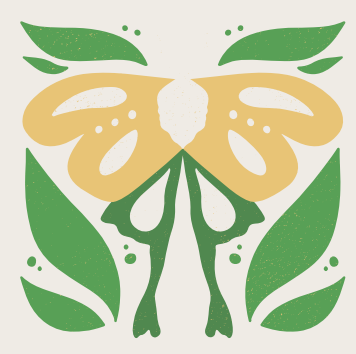
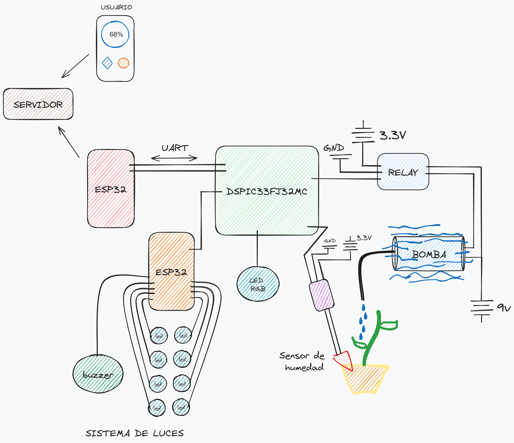

# HydroConCiencia
**Universidad Nacional Mayor de San Marcos**. ***E.P.A. de Ingeniería de Sistemas***

*Proyecto Final - Arquitectura de Computadoras - Semestre 2024-0*

HydroConCiencia es un proyecto de microcontroladores desarrollado con el fin de impulsar la modernización responsable en el hogar y ciudades, dando un paso próximo a las denominadas *smart cities*.

Este proyecto consiste en un prototipo de sistema de regado automatizado con agregados decorativos pensados para los interiores de los hogares. Tales agregados consisten en luces que se encienden y apagan con una canción predeterminada.

## Funcionamiento
Este proyecto se realizó bajo el siguiente esquema:

Como se aprecia, se tienen 3 microprocesadores trabajando en conjunto. Concretamente 2 ESP32 y un módulo dsPIC33FJ32MC204. Uno de los ESP32 tiene la tarea de conectarse a una serie de luces led y un par de buzzers para producir el show de luces con la música. Este ESP32 recibe señales del dsPIC que controla el encendido y apagado del circuito. 

El dsPIC se encarga en grán parte del procesamiento de señales, en este caso de las señales provenientes del sensor de humedad. al detectar baja humedad conecta un circuito para encender una minibomba que impulsará agua a la maceta.

Este dsPIC se comunica con otro ESP32 mediante protocolos UART en el cual envía la información de la humedad después de aplicar un filtro de suavizado de señales.

El 2do ESP32 es el encargado de alojar un servidor web en local, desde el cual las personas pueden acceder mediante cualquier dispositivo con wifi.

## Información Adicional
Este repositorio de creo con el fin de almacenar tanto el código como los informes y documentos relacionados con este proyecto.

***Nota:*** El código del servidor web (2do ESP32) se encuentra en el siguiente [repositorio](https://github.com/lucad-28/ServidorRiego)

Se puede encontrar informe y videos en [docs.md](./recursos/docs.md)

Integrantes del Equipo:

 | Nombres | Apellidos | Código |
 |---------|-----------|--------|
 |Davis Leonardo|Cartagena Valera Brush|22200193|
 |Aldair Alejandro|Rivera Llancari|22200134|
 |José Manuel|Sernaque Cobeñas| 22200182|
 |Said William|Najarro Llacza|22200031|
 |José Fernando|Huamani Quispe|22200113|
 |Jhair Roussell|Melendez Blas|22200199|